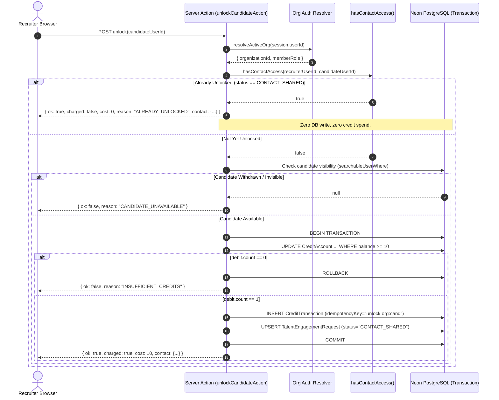

# ABTalks Architecture Specification

## 1. Overview & Platform Architecture

ABTalks is an enterprise talent and education platform connecting candidates (graduates, challenge participants, cohort students) with recruiters and partner organisations.

The platform architecture is built around three foundational pillars:
1. **Privacy-First Data Architecture (078 & DPDP Compliance):** Candidate data visibility is strictly opt-in and server-enforced. Recruiter access is gated by explicit status decisions, never ambient flags.
2. **Immutable Financial-Grade Ledgers:** All balances (student Synergy Points, recruiter Credits) are backed by append-only transaction ledgers. Stored balances are cached projections governed by optimistic locking, never authoritative counters.
3. **Multi-Tenant Isolation:** Recruiters belong to an `Organization`. All limits, unlocks, credits, and shortlists are scoped to the organisation, preventing cross-company leakage.

---

## 2. Recruiter Credit Ledger & Contact Unlock Architecture (Stream G0 / T-148)

> **Designation:** P0 · HIGH RISK (Money path & Candidate PII release)  
> **Requirement:** #66  
> **Author:** Zainab  
> **Technical Reviewer & Sign-off:** Sohail  

### 2.1 The Core Problem & Risk R17
A naive implementation would store a mutable `creditBalance Int` column on `Organization` or `RecruiterProfile` and decrement it on unlock.
**Why this is prohibited (Risk R17):**
- A bare counter makes double-charge protection impossible under retries.
- A bare counter cannot show *who* spent *what* on *which candidate* (blocking T-095 company admin auditing).
- A bare counter cannot support dispute resolution, admin corrections, or credit refunds without data corruption.
- Concurrent requests against a bare counter cause race conditions and balance overdrafts.

### 2.2 Decisions Status (D-16 & D-17)

| Decision | Question | Decision Status | Architecture Ruling |
|---|---|---|---|
| **D-16** | Is contact unlock a plan allowance or a money-shaped credit balance? | **DECIDED** | **CREDIT LEDGER.** Append-only double-entry ledger (`CreditTransaction`) with cached, versioned account summary (`CreditAccount`). Precedent: `PointsAccount` + `PointsTransaction` in `src/repositories/points.ts`. |
| **D-17** | Where do the starting credit amount and the unlock cost live? | **DECIDED** | **DATABASE CONFIGURATION, AUDITED.** Stored as data in `PlatformConfig` / `PlanLimit` (D-3). Initial seed: **100 credits on registration**, **10 credits per unlock**. Changes are data edits, not code deployments. |

---

## 3. Database Ledger Model

The credit ledger mirrors the proven Phase 2f/078 `PointsAccount` + `PointsTransaction` pattern (`prisma/schema.prisma:2867-2906`).

```
┌─────────────────────────────────────────────────────────────┐
│                        Organization                         │
└──────────────────────────────┬──────────────────────────────┘
                               │ 1:1
                               ▼
┌─────────────────────────────────────────────────────────────┐
│                        CreditAccount                        │
│ ─────────────────────────────────────────────────────────── │
│  id: String (cuid)                                          │
│  organizationId: String (unique)                            │
│  balance: Int (cached sum of CreditTransaction.amount)      │
│  lifetimeEarned: Int                                        │
│  lifetimeSpent: Int                                         │
│  version: Int (optimistic locking)                          │
│  reconciledAt: DateTime?                                    │
│  updatedAt: DateTime                                        │
└──────────────────────────────┬──────────────────────────────┘
                               │ 1:N
                               ▼
┌─────────────────────────────────────────────────────────────┐
│                      CreditTransaction                      │
│ ─────────────────────────────────────────────────────────── │
│  id: String (cuid)                                          │
│  organizationId: String (FK -> Organization)                │
│  recruiterUserId: String (FK -> User, who pressed unlock)   │
│  candidateUserId: String? (FK -> User, who was unlocked)    │
│  amount: Int (negative for debit/spend, positive for grant) │
│  type: CreditTransactionType (enum)                         │
│  sourceType: String ("TALENT_ENGAGEMENT_REQUEST", etc.)     │
│  sourceId: String? (engagementId)                           │
│  idempotencyKey: String (unique, deterministic)             │
│  reason: String?                                            │
│  metadata: Json?                                            │
│  createdAt: DateTime (now)                                  │
└─────────────────────────────────────────────────────────────┘
```

### Schema Guarantees
1. **Append-Only:** `CreditTransaction` rows are strictly inserted, never updated or deleted (`onDelete: Restrict`).
2. **Ground Truth:** True balance is always `SUM(CreditTransaction.amount) WHERE organizationId = :orgId`. `CreditAccount.balance` is an atomic, performant cache.
3. **Attribution:** Every consumption records both the recruiter who clicked (`recruiterUserId`) and the candidate revealed (`candidateUserId`), satisfying T-095.

---

## 4. Idempotency Key Design

Every debit transaction requires a deterministic `idempotencyKey`:
```
unlock:<organizationId>:<candidateUserId>
```

### Key Properties:
- **Organization Scoped:** If Recruiter A and Recruiter B from the same company both attempt to unlock Candidate C, they resolve to the same idempotency key: `unlock:org_abc:user_xyz`.
- **Database Unique Constraint:** `CREATE UNIQUE INDEX "CreditTransaction_idempotencyKey_key" ON "CreditTransaction"("idempotencyKey");`
- **Network Retry Resilience:** If a network timeout occurs between deduction and client response, retrying the operation hits the idempotency guard and safely returns success with zero additional deduction.

---

## 5. Concurrency Protection & Overspending Prevention

### The Ten-Concurrent-Unlock Case (Affording Five)
**Scenario:** An organisation has a balance of **50 credits**. Each unlock costs **10 credits** (affording exactly 5 unlocks). The recruiter (or multiple recruiters in the same company across 10 browser tabs) fires **10 concurrent unlock requests** simultaneously.

### The Mechanism: `debit_strict` Atomic Conditional Decrement
We enforce the atomic conditional update pattern from `src/repositories/points.ts:284-291` & `428-440`:

```sql
UPDATE "CreditAccount"
SET "balance" = "balance" - :cost,
    "lifetimeSpent" = "lifetimeSpent" + :cost,
    "version" = "version" + 1,
    "reconciledAt" = NOW()
WHERE "organizationId" = :orgId
  AND "balance" >= :cost;
```

### Transaction & Locking Walkthrough:
1. All 10 requests enter `prisma.$transaction`.
2. PostgreSQL acquires an exclusive row-level write lock on the specific `CreditAccount` row for `orgId`.
3. The requests queue on the row lock and evaluate sequentially:
   - **Request 1:** `balance` = 50. Condition `50 >= 10` is TRUE. Row updated to `balance = 40`. Affected rows = 1.
   - **Request 2:** `balance` = 40. Condition `40 >= 10` is TRUE. Row updated to `balance = 30`. Affected rows = 1.
   - **Request 3:** `balance` = 30. Condition `30 >= 10` is TRUE. Row updated to `balance = 20`. Affected rows = 1.
   - **Request 4:** `balance` = 20. Condition `20 >= 10` is TRUE. Row updated to `balance = 10`. Affected rows = 1.
   - **Request 5:** `balance` = 10. Condition `10 >= 10` is TRUE. Row updated to `balance = 0`. Affected rows = 1.
   - **Request 6:** `balance` = 0. Condition `0 >= 10` is **FALSE**. **Affected rows = 0.**
   - **Requests 7, 8, 9, 10:** Same: Condition evaluates to **FALSE**. **Affected rows = 0.**
4. For Requests 6–10, `debit.count === 0`. The application detects the failure, aborts the transaction, and returns:
   ```json
   { "ok": false, "reason": "INSUFFICIENT_CREDITS", "remaining": 0 }
   ```
5. **Result:** Exactly 5 succeed. Exactly 5 fail with a clean, readable error. The balance ends at exactly 0. Overspending or negative balances are impossible.

---

## 6. The Repeat Unlock Path (Double-Charge Protection)

**Scenario:** A recruiter clicks unlock on a candidate they have already unlocked, or double-clicks the unlock button.

### Execution Flow:


### Key Guarantees:
1. **Access check first:** `hasContactAccess()` runs *before* any commercial logic. If access already exists, it short-circuits immediately.
2. **Idempotency collision:** If two identical unlock requests bypass step 3 simultaneously, Step 5's unique constraint on `idempotencyKey` triggers a `P2002` error, rolling back the transaction and preventing duplicate billing.

---

## 7. Commercial Gate vs. Privacy Gate Non-Negotiable Constraint

From `features/hire/locked-preview.ts`:
> *"A commercial gate may only ever show a subset of what the privacy gate already permits. Paying cannot widen it."*

1. **`hasContactAccess()` is the sole reader:**
   Located in `src/features/hire/contact-access.ts`, derived solely from `TalentEngagementRequest.status === "CONTACT_SHARED"`. It is **unchanged** by this plan.
2. **Candidate Privacy Switches:**
   Candidate contact revelation respects `showEmail`, `showPhone`, and `showResume`:
   - `email`: Revealed on unlock.
   - `phone`: Revealed only if candidate's `showPhone` switch is TRUE.
   - `resume`: Revealed via private blob stream only if candidate's `showResume` switch is TRUE.
3. **No Leakage in Refusal:**
   If credits are insufficient or access is denied, server responses contain **zero** contact fragments (no partial email, no masked phone).

---

## 8. Technical Review & Sign-Off

- **Technical Reviewer:** Sohail (Sk Sohail Swaraj, Architect & Tech Lead)
- **Status:** APPROVED & SIGNED FOR ARCHITECTURE
- **Approval Date:** 2026-09-08
- **Next Step:** Wave 1 Build tasks (T-032, T-033, T-030, T-095) may proceed against this design.
